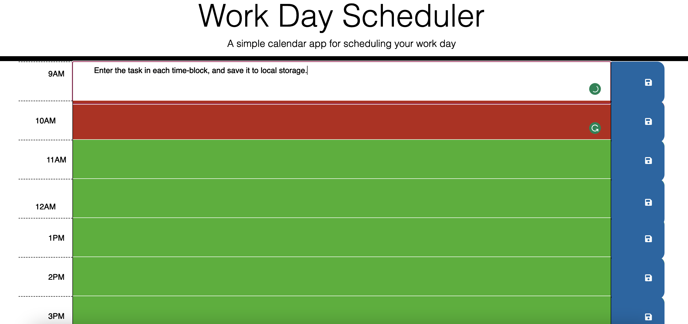

# Third-Party-APIS-Workday-Scheduler

## Description

In this project I created a work-day calendar for users to log in their tasks for the day in each time block. The user will be able to save the task into local storage.

[Link to deployed application]()

## Installation

N/A

## Usage

## Credits

N/A

## License

[MIT](https://choosealicense.com/licenses/mit/)